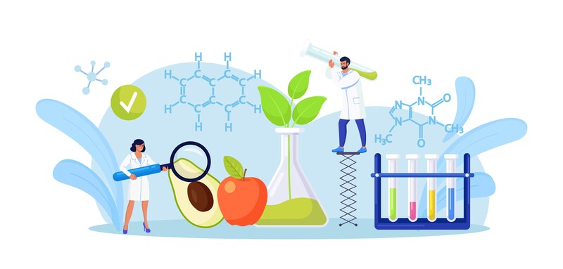

# A.I. Medical Scientist

## A research and healthcare automated data provider leveraging artificial intelligence

  <h2> This repo is NOT ready for use yet. </h2>

## <u>Summary</u>

This repository aims to revolutionize the way information about diseases—both curable and incurable—is rapidly collected and analyzed. Leveraging the power of Large Language Models (LLMs), the system is designed to swiftly aggregate data, treatment options, and emerging scientific insights about specified medical conditions. By providing a comprehensive and robust analysis, this automated platform serves as a valuable resource for medical professionals, researchers, and anyone seeking in-depth knowledge on a range of diseases.

## <u>Thesis</u>

The extensive body of medical research generated in academic settings frequently goes unnoticed by overburdened clinicians who could benefit from these advancements. Utilizing artificial intelligence—particularly sophisticated language models—and engineering automation techniques, we can develop a streamlined, highly effective system to seamlessly disseminate crucial medical information to healthcare professionals, thereby enhancing patient care and treatment outcomes.

## <u>Prerequisites</u>

1. Python Installed (Version 3)
2. Git Installed
3. Conda (python env manager) or similar

## <u>Recommendations</u>

1. Virtual Python Environment
2. Python 3.10 or greater

## <u>Installation and Usage</u>

1. Clone the repository `git clone git@github.com:joecodecreations/AIMedicalScientist.git`
2. Jump into the directory `cd AIMedicalScientist/` 
2. Install requirements `pip install -r requirements.txt`
3. Move .env.sample to .env to store environment variables `mv .env.sample .env`
4. Add your openAI token into the **.env** file and save the file
5. Next open your **config/settings.ini** file and update the **RESEARCH_TOPIC** field.
6. Run `python main.py` to execute the program and gather research details

Now your files should be contained within the **/data/** subfolder broken down by category and topics within each category.

## <u>Settings</u> 
##### Settings found in your `'./config/settings.ini'`

Settings are broken down into different sections such as:

SOFTWARE, AI, SYSTEM, TOP_LEVEL_FLAGS etc.

Below describes each settings and what they do for each of the sections in your settings.ini file.

#### &nbsp; [SOFTWARE]

###### &nbsp;&nbsp; [RESEARCH_TOPIC]

<b>Research Keyword or Phrase</b> 

Research topic is the line where you want to add whatever the subject is you want the AIMS system to gather information on. Simply write out something like "Lung Cancer", "High Blood Pressure" etc. 

 

###### &nbsp;&nbsp; [TYPE]

 
<b>Type of Research (Medical or Research)</b> 

There are two main types of automated AIMS categories, Medical & Research. <b>Here's the main difference between the two:</b>

 

#####  &nbsp;&nbsp;&nbsp;&nbsp;&nbsp;&nbsp;&nbsp;&nbsp;  Medical: 

> Medical attempts to provide you information on cures, treatments, known genetic bio marker information and speculative data related to an illness, medical condition, cancer etc. 

#####  &nbsp;&nbsp;&nbsp;&nbsp;&nbsp;&nbsp;&nbsp;&nbsp;  Research: 

> Research should be used when you're wanting information on something that doesn't fall under Medical but might be a singular item like a perscription drug, molecule, DNA bio marker or sequence, compound, chemical etc. and will try to find as much information about these for you as possible. This could be things like: known & speculative uses, dosage, LD50 levels, poison control information and more. 

## Disclaimer & Disclosure

This system / code is intended to serve as a supplementary resource for medical professionals, researchers, and individuals interested in obtaining a broad overview of diseases and related treatments. It should not be used as a substitute for professional medical advice, diagnosis, or treatment. The data and analysis provided by this automated platform are sourced from Large Language Models and curated databases, and while we strive for accuracy, we cannot guarantee the completeness or timeliness of the information presented.

Users are advised to consult qualified healthcare providers for personalized medical advice and treatment. We disclaim any liability for any damages or adverse effects arising from the use or reliance on the information provided by this system. Furthermore, the system does not endorse any specific medication, treatment, or therapy, and the inclusion of such information does not imply its effectiveness or suitability for any particular condition or individual.

By using this system, you acknowledge and agree to these limitations and assume all responsibility and risk associated with the use of the information provided.